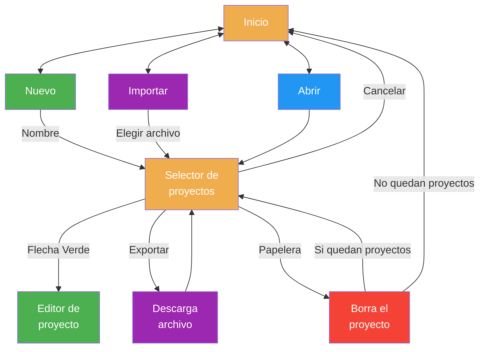

# Easy Point

**Easy Point** es una herramienta online que permite calcular las señales de PLC y en futuras versiones generar automáticamente la memoria de control para proyectos HVAC (calefacción, ventilación y aire acondicionado). Pensada para ingenierías, técnicos e instaladores que desean agilizar la documentación técnica durante la fase de diseño o estudio.

> Esta herramienta está pensada como ayuda en fases preliminares de proyecto. Para el dimensionado y selección definitiva de equipos, es imprescindible contar con el asesoramiento de un profesional cualificado.

## 0.Contenido

- [1. Características](#1características)
- [2. Primeros pasos](#2primeros-pasos)
- [3. Pantalla de inicio](#3pantalla-de-inicio)
- [4. Editor de proyecto](#4editor-de-proyecto)
  - [4.1 Gestión del proyecto](#41-gestión-del-proyecto)
    - [4.1.1 Renombrar / Sobrescribir](#411-renombrar--sobrescribir)
    - [4.1.2 Guardar proyecto](#412-guardar-proyecto)
    - [4.1.3 Generar PDF](#413-generar-pdf)
    - [4.1.4 Salir del proyecto](#414-salir-del-proyecto)
  - [4.2 Añadir bloques funcionales](#42-añadir-bloques-funcionales)
  - [4.3 Gestión general del bloque](#43-gestión-general-del-bloque)
  - [4.4 Gestión de elementos dentro del bloque](#44-gestión-de-elementos-dentro-del-bloque)
  - [4.5 Elementos personalizados](#45-elementos-personalizados)
  - [4.6 Persistencia](#46-persistencia)
- [5. Acceso](#5acceso)
- [6. Flujo pantalla de inicio (guía visual)](#6flujo-pantalla-de-inicio-guía-visual)
- [7. Flujo para Renombrar / Sobrescribir / Duplicar](#7flujo-para-renombrar--sobrescribir--duplicar)

## 1.Características

- Cálculo automático de señales de entrada/salida por bloque funcional.
- Generación de documentos en PDF de:
    + Estudio de señales.
    + Memoria de control (en desarrollo).
- Interfaz sencilla y orientada a la productividad.
- Compatible con navegadores modernos y ejecutable offline.

---

## 2.Primeros pasos

1. En la [pantalla de inicio](#3pantalla-de-inicio), haz clic en **"Nuevo"** para crear un nuevo proyecto.
2. Introduce el nombre del proyecto y presiona **ENTER**.
3. Se abrirá el diálogo de selección de proyectos con el nuevo proyecto ya seleccionado. Haz clic en el boton verde con la flecha.
4. Se mostrará el [editor de proyecto](#4editor-de-proyecto).
5. Debajo de la cabecera, selecciona el tipo de bloque que deseas añadir (por ejemplo, **"Circuito Calefacción/Distribución"**) y haz clic en **"Añadir"**.
6. Aparecerán todos los elementos asociados al bloque, con algunos ya seleccionadas por defecto y sus señales.
7. Puedes seleccionar o deseleccionar elementos libremente, así como editar sus nombres y el del bloque.
8. Puedes cambiar el número de instancias de un elemento (por ejemplo, poner **2** en un elemento temperatura y nombrarlo como "Temperatura Impulsión y Retorno").
9. Puedes añadir elementos personalizadas y asignarle las señales que quieras si nunguno de los existentes en el bloque cuadra con lo que necesitas, tambien puedes eliminar estos elementos personalizados.
10. Si aumentas el número al lado del nombre del bloque (en la primera fila de cada bloque), todas las señales del bloque se multiplicarán en esa proporción. Esto es útil para crear, por ejemplo, **3 circuitos de calefacción iguales** en un solo bloque.
11. Puedes añadir tantos bloques como necesites y modificarlos en cualquier momento.
12. Cuando termines, puedes guardar el proyecto desde la parte superior. La información se almacenará **localmente** en tu dispositivo.
13. Haz clic en **"PDF"** para generar y descargar un documento PDF con el contenido del proyecto, listo para incluir en la documentación técnica.
14. Al hacer clic en **"Salir"**, regresarás al selector de proyectos, donde podrás abrir o eliminar proyectos existentes.
15. Si haces clic en la **"X"** en la parte superior, volverás a la pantalla principal para crear un nuevo proyecto.

---

## 3.Pantalla de inicio

Al acceder a Easy Point, se muestra una **pantalla de inicio** con tres opciones principales: **"Nuevo"**, **Importar** y **"Abrir"**( Deshabilitado si no hay proyectos existentes).

- Al hacer clic en **"Nuevo"** (verde):
  - Se accede a la **pantalla de creacion de proyecto**.
  - El boton **"Nuevo"**pasa a ser **Cancelar** para poder volver a la **pantalla de inicio**.
  - Se deshabilitan los botones **Importar** y **"Abrir"**.
  - Se muestra un campo de texto para **Nombre del nuevo proyecto**.
  - Tras introducir el nombre deseado, al pulsar **ENTER**, o presionando el botón de confirmación verde con icono ✔, se accede a la pantalla **selección de proyectos**, con el nuevo proyecto ya seleccionado.

- Clicando en **Importar** (morado): 
  - Se abre un cuadro de diálogo para elegir el archivo con el proyecto a importar.
  - Una vez importado, se accede a la pantalla **selección de proyectos**, con el nuevo proyecto ya seleccionado.

- Si se hace clic en **"Abrir"** (azul):
  - Se accede a la **pantalla de selección de proyectos**.
  - El boton **Abrir** pasa a ser **Cancelar** para poder volver a la **pantalla de inicio**.
  - Se deshabilita el boton **Nuevo**.
  - El boton **Importar** pasa a ser **Exportar**.
  - Aparece un cuadro de selleccion para elegir uno entre todos los proyectos que tengamos almacenados en nuestro ordenador.
  - Presionando en **Exportar** se descarga un archivo con la copia del proyecto que tengamos seleccionado, para tener un copia de seguridad, o poder enviarlo a otros, ...
  - Se puede eliminar de nuestro ordenador el proyecto seleccionado presionando el boton con icono de papelera (pide confirmación).
  - Si se eliminan todos los proyectos, se regresa automáticamente a la **pantalla de inicio** con el botón "Abrir" deshabilitado.
  - por Ultimo presionando en el boton verde con el icono de flecha hacia la derecha accederemos al editor del proyecto.

**PRO TIP**: Para empezar un nuevo proyecto duplicando uno exitente, basta con exportar el proyecto existente, cambiar el nombre al archivo exportado con el nombre del nuevo proyecto e importarlo. 

---

## 4.Editor de proyecto

Una vez abierto un proyecto desde la pantalla de selección, se accede al editor principal.
El editor está diseñado para agregar bloques de control, como una caldera o un conjunto de producción de ACS.
En cada bloque se pueden definir y ajustar todos los elementos que incluye dicho bloque y añadir hasta 100 elementos personalizados por bloque.
A continuación se detallan las opciones disponibles:

### 4.1 Gestión del proyecto

En la parte superior de la pantalla del editor, se dispone de un recuadro de texto que muestra el nombre actual del proyecto junto con los botones **Guardar**, **PDF** y **Salir**. 

#### 4.1.1 Renombrar / Sobrescribir
- El recuadro de texto contiene por defecto el nombre que se introdujo al crear el proyecto desde la pantalla de inicio.
- Puedes cambiar este nombre directamente desde el input.  
- Si introduces un nombre **ya existente** (idéntico al de otro proyecto), el campo se **sombrea en rojo** para advertir del conflicto.
- Al pulsar **Guardar**, se solicitará confirmación para sobrescribir el proyecto existente con ese nombre.

#### 4.1.2 Guardar proyecto
- Pulsa el botón **"Guardar"** para almacenar el estado actual del proyecto.
- El contenido se guarda **localmente en tu navegador**, sin necesidad de conexión a internet.

#### 4.1.3 Generar PDF
- Pulsa el botón **"PDF"** para generar un documento con todos los bloques y elementos con sus señales del proyecto.
- El documento generado:
  - Está optimizado para su uso en documentación técnica.
  - Permite **copiar y pegar texto** fácilmente en programas como Word o Excel.

#### 4.1.4 Salir del proyecto
- El botón **"Salir"** te lleva al **selector de proyectos**, donde puedes abrir o eliminar otros proyectos.
- Si se han realizado modificaciones en los bloques del proyecto, al intentar salir sin guardar aparecerá una advertencia informando que se **perderán los cambios** si se continúa.
- Esta advertencia **no se muestra** si el único cambio ha sido editar el nombre del proyecto (arriba del todo) y no se ha modificado el contenido del proyecto.

### 4.2 Añadir bloques funcionales
   - Bajo la cabecera hay un selector desplegable para elegir un tipo de bloque (por ejemplo, **"Circuito Calefacción/Distribución"**).
   - Pulsa el botón **"Añadir"** para incorporarlo al proyecto.
   - Puedes repetir el tipo de bloque pero ten en cuenta que si son exactamente iguales quedara mas claro usar el multiplicador en la cabecera de cada bloque. Ver siguiente apartado.

### 4.3 Gestión general del bloque
   En la fila superior de cada bloque encontrarás:
   - Un **botón para eliminar** el bloque del proyecto.
   - Un **campo de texto** para **renombrar** el bloque.
   - Un **input numérico** para indicar cuántos bloques iguales se necesitan (por ejemplo, 3 circuitos de calefacción).  
     Esto **multiplica automáticamente todas las señales** contenidas en el bloque.

### 4.4 Gestión de elementos dentro del bloque
   Cada línea representa un elemento con sus señales asociadas y permite:
   - Activarla o desactivarla según sea necesario. Los elementos más habituales aparecen activadas por defecto al añadir un nuevo bloque.
   - Editar el **nombre del elemento**.
   - Usar un **input numérico** para indicar cuántas instancias específicas de ese elemento se necesitan.  
     Por ejemplo, una bomba con marcha-paro y verificación puede configurarse con 2 instancias si se trata de una **bomba gemela**, sin afectar al resto de elementos del bloque.

### 4.5 Elementos personalizados
   Al final de cada bloque aparece una linea vacia con un pequqeño boton que añadira un elemento con señales personalizadas:
   - Una vez presionado debes elegir el numero de señales asociadas a un elemento y darle a aceptar (o cancelar si has cambiado de opinion).
   - Una vez creado, en vez del check para activar o desactivar el elemento aparecera un boton rojo con un aspa para poder borrar el elemento creado.
   - Puedes asignar un nombre al elemento y modificar la cantidad que necesitas, igual que con cualquier otro elemento del bloque.
   - Hay un maximo de 100 elementos presonalizados que se pueden añadir en cada bloque.

### 4.6 Persistencia
- Si el navegador se cierra con cambios pendientes de guardar, el sistema de persistencia recuperará dichos cambios al volver a abrir la página. 
- No obstante, se recomienda no depender únicamente de esta funcionalidad y guardar siempre el proyecto de forma manual. 
- La persistencia está diseñada como medida de seguridad frente a apagados inesperados del equipo o cierres accidentales del navegador.

---

## 5.Acceso

Accede a la herramienta aquí:  
[https://easypoint.arcsl.com](https://easypoint.arcsl.com)

---

## 6.Flujo gestión de proyectos (guía visual)

