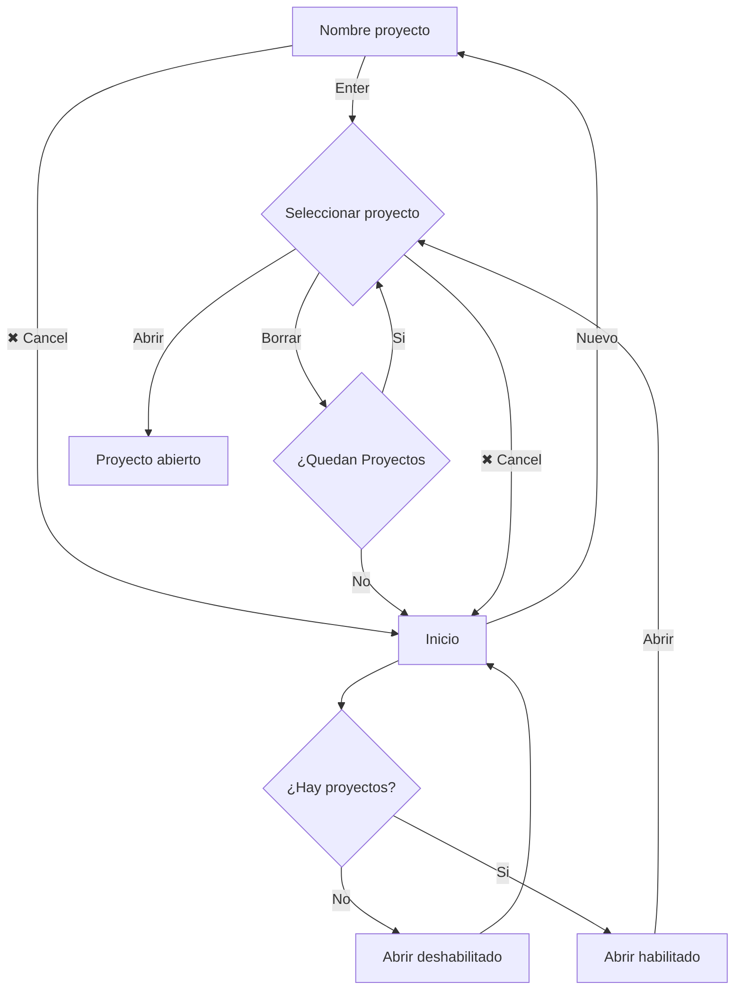
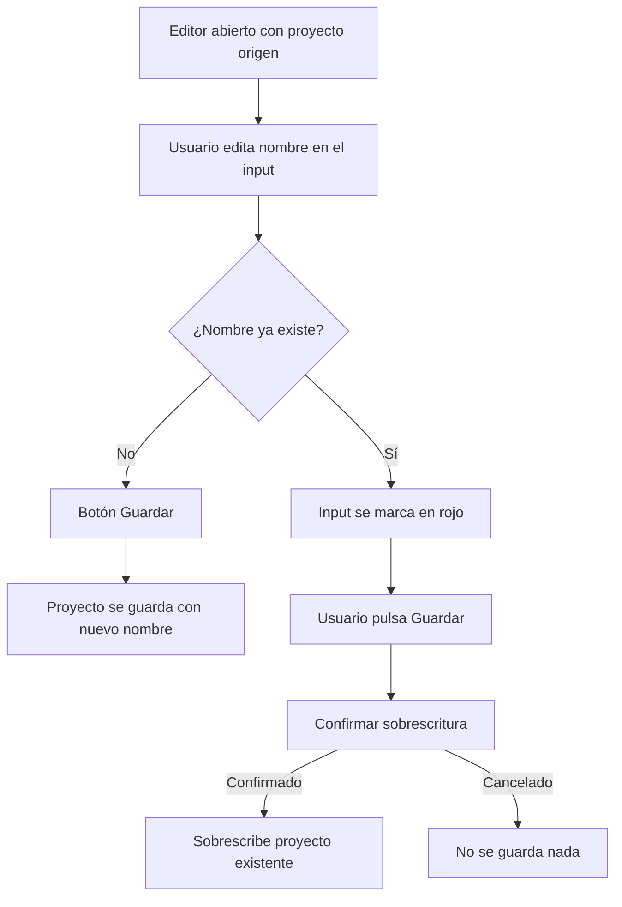

# Easy Point

**Easy Point** es una herramienta online que permite calcular las señales de PLC y en futuras versiones generar automáticamente la memoria de control para proyectos HVAC (calefacción, ventilación y aire acondicionado). Pensada para ingenierías, técnicos e instaladores que desean agilizar la documentación técnica durante la fase de diseño o estudio.

> Esta herramienta está pensada como ayuda en fases preliminares de proyecto. Para el dimensionado y selección definitiva de equipos, es imprescindible contar con el asesoramiento de un profesional cualificado.

## 0.Contenido

- [1. Características](#1características)
- [2. Primeros pasos](#2primeros-pasos)
- [3. Pantalla de inicio](#3pantalla-de-inicio)
- [4. Editor de proyecto](#4editor-de-proyecto)
  - [4.1 Gestión del proyecto](#41-gestión-del-proyecto)
    - [4.1.1 Renombrar / Sobrescribir / Duplicar](#411-renombrar--sobrescribir--duplicar)
    - [4.1.2 Guardar proyecto](#412-guardar-proyecto)
    - [4.1.4 Generar PDF](#414-generar-pdf)
    - [4.1.5 Salir del proyecto](#415-salir-del-proyecto)
  - [4.2 Añadir bloques funcionales](#42-añadir-bloques-funcionales)
  - [4.3 Gestión general del bloque](#43-gestión-general-del-bloque)
  - [4.4 Gestión de señales dentro del bloque](#44-gestión-de-señales-dentro-del-bloque)
- [5. Acceso](#5acceso)
- [6. Flujo pantalla de inicio (guía visual)](#6flujo-pantalla-de-inicio-guía-visual)
- [7. Flujo para Renombrar / Sobrescribir / Duplicar](#7flujo-para-renombrar--sobrescribir--duplicar)

## 1.Características

- Cálculo automático de señales de entrada/salida por bloque funcional.
- Generación de documentos en PDF de:
    + Estudio de señales.
    + Memoria de control (en desarrollo).
- Interfaz sencilla y orientada a la productividad.
- Compatible con navegadores modernos y ejecutable offline.

---

## 2.Primeros pasos

1. En la [pantalla de inicio](#3pantalla-de-inicio), haz clic en **"Nuevo"** para crear un nuevo proyecto.
2. Introduce el nombre del proyecto y presiona **ENTER**.
3. Se abrirá el diálogo de selección de proyectos con el nuevo proyecto ya seleccionado. Haz clic en **"Abrir"**.
4. Se mostrará el [editor de proyecto](#4editor-de-proyecto).
5. Debajo de la cabecera, selecciona el tipo de bloque que deseas añadir (por ejemplo, **"Circuito Calefacción/Distribución"**) y haz clic en **"Añadir"**.
6. Aparecerán todas las señales asociadas al bloque, con algunas ya seleccionadas por defecto.
7. Puedes seleccionar o deseleccionar señales libremente, así como editar sus nombres y el del bloque.
8. Puedes cambiar el número de instancias de una señal (por ejemplo, poner **2** en una señal de temperatura y nombrarlas como "Temperatura Impulsión y Retorno").
9. Si aumentas el número en la fila del nombre del bloque, todas las señales se duplicarán en esa proporción. Esto es útil para crear, por ejemplo, **3 circuitos de calefacción iguales** en un solo bloque.
10. Puedes añadir tantos bloques como necesites y modificarlos en cualquier momento.
11. Cuando termines, puedes guardar el proyecto desde la parte superior. La información se almacenará **localmente** en tu dispositivo.
12. Haz clic en **"PDF"** para generar y descargar un documento PDF con el contenido del proyecto, listo para incluir en la documentación técnica.
13. El PDF generado permite **copiar y pegar texto**, facilitando su uso en editores como Word o Excel.
14. Al hacer clic en **"Salir"**, regresarás al selector de proyectos, donde podrás abrir o eliminar proyectos existentes.
15. Si haces clic en la **"X"** en la parte superior, volverás a la pantalla principal para crear un nuevo proyecto.

---

## 3.Pantalla de inicio

Al acceder a Easy Point, se muestra una pantalla inicial con dos opciones principales: **"Nuevo"** y **"Abrir"**.

- Si **no hay proyectos almacenados**, el botón **"Abrir"** aparecerá **deshabilitado**.
- Al hacer clic en **"Nuevo"**:
  - Se muestra un campo de texto para **introducir el nombre del nuevo proyecto**.
  - Al pulsar **ENTER**, se accede directamente a la pantalla de **selección de proyectos**, con el nuevo proyecto ya seleccionado.
  - También se muestra un botón con un **aspa (✖)** que permite cancelar y **volver a la pantalla de inicio**.
- Si se hace clic en **"Abrir"** (cuando hay proyectos disponibles):
  - Se accede a la **pantalla de selección de proyectos** donde se pueden:
    - Abrir proyectos existentes.
    - Borrar el proyecto seleccionado (previa confirmación).
    - Cancelar y volver a la pantalla de inicio con el botón de aspa (✖).
  - Si se borran todos los proyectos, se regresa automáticamente a la **pantalla de inicio** con el botón "Abrir" deshabilitado.

Este flujo garantiza que siempre haya un proyecto seleccionado y listo para editarse, o bien que el usuario pueda crear uno nuevo desde cero si es la primera vez que usa la herramienta.

---

## 4.Editor de proyecto

Una vez abierto un proyecto desde la pantalla de selección, se accede al editor principal.
El editor está diseñado para agregar bloques de control, como una caldera o un conjunto de producción de ACS.
En cada bloque se pueden definir y ajustar todas las señales que incluye. 
A continuación se detallan las opciones disponibles:

### 4.1 Gestión del proyecto

En la parte superior de la pantalla del editor, se dispone de un recuadro de texto que muestra el nombre actual del proyecto junto con los botones **Guardar**, **PDF** y **Salir**. 

#### 4.1.1 Renombrar / Sobrescribir / Duplicar
- El recuadro de texto contiene por defecto el nombre que se introdujo al crear el proyecto desde la pantalla de inicio.
- Puedes cambiar este nombre directamente desde el input.  
- Si introduces un nombre **ya existente** (idéntico al de otro proyecto), el campo se **sombrea en rojo** para advertir del conflicto.
- Al pulsar **Guardar**, se solicitará confirmación para sobrescribir el proyecto existente con ese nombre.
- Esta funcionalidad permite **duplicar un proyecto fácilmente**, siguiendo este flujo:
  1. Crear un nuevo proyecto vacío (proyecto destino).
  2. Abrir el proyecto que se desea copiar (proyecto origen).
  3. En el input superior del proyecto origen, introducir el nombre del proyecto destino.
  4. Pulsar **Guardar** y confirmar la sobrescritura.
  5. Ahora ambos proyectos contienen el mismo contenido y pueden editarse por separado.

#### 4.1.2 Guardar proyecto
- Pulsa el botón **"Guardar"** para almacenar el estado actual del proyecto.
- El contenido se guarda **localmente en tu navegador**, sin necesidad de conexión a internet.

#### 4.1.4 Generar PDF
- Pulsa el botón **"PDF"** para generar un documento con todos los bloques y señales del proyecto.
- El documento generado:
  - Está optimizado para su uso en documentación técnica.
  - Permite **copiar y pegar texto** fácilmente en programas como Word o Excel.

#### 4.1.5 Salir del proyecto
- El botón **"Salir"** te lleva al **selector de proyectos**, donde puedes abrir o eliminar otros proyectos.
- Si se han realizado modificaciones en los bloques o señales del proyecto, al intentar salir sin guardar aparecerá una advertencia informando que se **perderán los cambios** si se continúa.
- Esta advertencia **no se muestra** si el único cambio ha sido editar el nombre del proyecto en el input superior (sin haber modificado el contenido del proyecto).

### 4.2 Añadir bloques funcionales
   - Bajo la cabecera hay un selector desplegable para elegir un tipo de bloque (por ejemplo, **"Circuito Calefacción/Distribución"**).
   - Pulsa el botón **"Añadir"** para incorporarlo al proyecto.
   - Puedes repetir el tipo de bloque pero ten en cuenta que si son exactamente iguales quedara mas claro usar el multiplicador en la cabecera de cada bloque. Ver siguiente apartado.

### 4.3 Gestión general del bloque
   En la fila superior de cada bloque encontrarás:
   - Un **botón para eliminar** el bloque del proyecto.
   - Un **campo de texto** para **renombrar** el bloque.
   - Un **input numérico** para indicar cuántos bloques iguales se necesitan (por ejemplo, 3 circuitos de calefacción).  
     Esto **multiplica automáticamente todas las señales** contenidas en el bloque.

### 4.4 Gestión de señales dentro del bloque
   Cada línea representa una señal y permite:
   - Activarla o desactivarla según sea necesario. Las señales más habituales aparecen activadas por defecto al añadir un nuevo bloque.
   - Editar el **nombre de la señal**.
   - Usar un **input numérico** para indicar cuántas instancias específicas de esa señal se necesitan.  
     Por ejemplo, una bomba con marcha-paro y verificación puede configurarse con 2 instancias si se trata de una **bomba gemela**, sin afectar al resto de señales del bloque.

---

## 5.Acceso

Accede a la herramienta aquí:  
[https://easypoint.arcsl.com](https://easypoint.arcsl.com)

---

## 6.Flujo pantalla de inicio (guía visual)

---

## 7.Flujo para Renombrar / Sobrescribir / Duplicar

